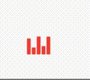

# flutter_animated_play_button

The package contains only a Flutter widget, AnimatedPlayButton.

AnimatedPlayButton is a widget presenting several animating bars, which
represent we are playing an item such as a track or a playlist.

It looks like:

An example built with Flutter Web is available at https://zonble.github.io/flutter_animated_play_button/

To use the widget, just creates an instance of it and place it into your Widget
tree. You can specify its `child` or `color` as well.

You can ask the widget to start or stop animating anytime when you build the
widget.

The package is derived from the app "KKBOX Kids".